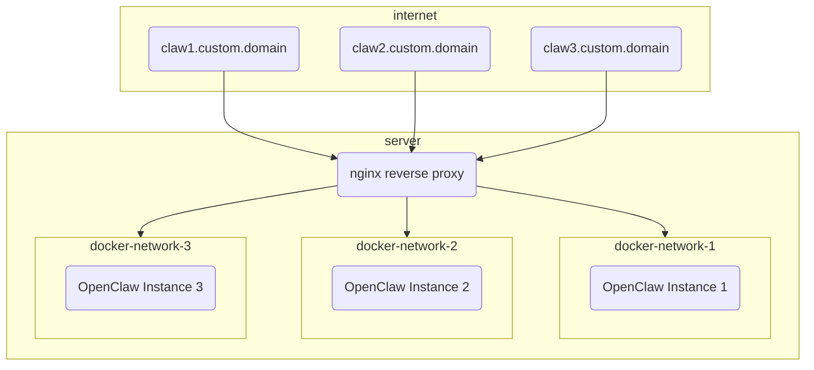

[OpenClaw](https://openclaw.ai/) is the hot new thing in the world of AI and tech. It's a fairly open ended tool that allows you to run a personalized AI agent on your own hardware. It can run command line tools, perform web searches, write code, run desktop apps, and perform scheduled tasks, making it an excellent personal aid. All of that is paired with its extensive communication integrations, which allow you to chat with and control it through almost any messaging app.

OpenClaw is designed to be more than another AI agent. The fact that it can run your desktop empowers both you and it to do more than a standard cloud-based AI tool. As you'd expect, however, that comes with huge security implications.

I've opted not to run OpenClaw on any of my personal hardware. Instead, I'm trying to use it by giving it segmented virtual workspaces that it can own and operate within. This persistent workspace, along with the flexibility in tools I'll give it, makes it more useful for asynchronous tasks than current cloud offerings.

<!-- truncate -->



## Before We Begin
There's a lot of ways to setup OpenClaw and how I'm doing it is not considered the normal pattern. It focuses on segmentation, not strict isolation. This is also not a guide in how to configure OpenClaw, just how to get it running. I'd recommend anyone reading this to have familiarized themselves with what OpenClaw is capable of and the various ways it can be created and configured. They have [easy to follow setup guides](https://docs.openclaw.ai/start/getting-started) on their website.

### Don't Sue
I'm writing this guide as I work through and learn this myself, and I am no expert here. Follow at your own risk and be mindful of what you're running. This guide is likely to become out-of-date pretty quickly. OpenClaw and AI are evolving at breakneck speeds and this document could be irrelevant next week.

### Infrastructure
I'm configuring this on a [DigitalOcean 2GB/2vCPU droplet](https://www.digitalocean.com/pricing/droplets) running [Ubuntu](https://ubuntu.com) 24 LTS; which I plan on hosting multiple isolated OpenClaw instances on via [Docker](https://www.docker.com).

### Terms to Know
I've tried to keep this guide abstract but at times I may reference my own file paths, usernames, etc. as I document this. Know that `zach`, `lod`, `lodsoftworks`, `lod-softworks`, and `zachcutler.me` reflect my person and organization and should be replaced with your own information.

## Ubuntu Setup
I'm starting with a fresh droplet so we'll need to do some basic OS management. If you've already got a host setup you can skip to the next section.

### Local User Setup

#### Create New Admin User
Run the following commands to create a new user and copy the existing SSH keys (if preconfigured for root, otherwise create them) to the new user's SSH directory.
```bash
# Create login user (admin/sudo)
adduser myusername
usermod -aG sudo myusername

# Copy SSH keys - If these were not added by a hosting provider (i.e. DigitalOcean) you may just need to create them in the proper directory.
rsync --archive --chown=myusername:myusername ~/.ssh /home/myusername
chmod 700 /home/myusername/.ssh
chmod 600 /home/myusername/.ssh/authorized_keys
```
⚠️ Verify the new user can login using a 2nd shell session before continuing further and that they have `sudo` permissions.
```bash
# Verify user = myusername
whoami

# Verify user = root
sudo whoami
```

#### Disable Root User
```bash
# Lock the root user using the -l (L for lock) flag
sudo passwd -l root
```

### Network Security

#### Secure SSH
Modify the SSH config to disable root login and require both public key + password authention. The file is large but look for these values, ensure they are uncommented and set to the correct values.
```bash
sudo vim /etc/ssh/sshd_config

# Disables root login
PermitRootLogin no

# Enables Password & Public Key auth
PasswordAuthentication yes
PubkeyAuthentication yes
UsePAM yes

# Sets the authentication mode to require both password & publickey
AuthenticationMethods publickey,password
⚠️ There may be override files that explicitly change these settings (i.e. `/etc/ssh/sshd_config.d/50-cloud-init.conf`) that may need to be changed as well.
```
Then verify the configuration is valid
```bash
# Will generate a message if there is an invalid config, no response is a good response.
sudo sshd -t
```
Reboot the system (or restart the ssh service) and login as the new user 😀

#### Enable firewall
Configure the default firewall to only allow SSH & HTTP connections, then enable it.
```bash
sudo ufw default deny incoming
sudo ufw default allow outgoing

sudo ufw allow 22/tcp
sudo ufw allow 80/tcp
sudo ufw allow 443/tcp

sudo ufw enable
sudo ufw status verbose
sudo ufw status numbered
```

#### Enable fail2ban
Configure fail2ban, a service which monitors network activity for bad actors (via logs, journals, etc) and can perform network bans on IPs and what not.
```bash
# Install fail2ban
sudo apt install fail2ban

# Ensure the install started the service
sudo systemctl status fail2ban
sudo fail2ban-client ping
```
Create a new config override file to start adding our rules to.
```bash
# Default config is /etc/fail2ban/jail.conf and should not be modified
sudo vim /etc/fail2ban/jail.local
```
```ini
[DEFAULT]
bantime = 1h
findtime = 10m
maxretry = 5
backend = systemd
banaction = ufw

[sshd]
enabled = true
port = 22
```
Restart and enable the service and confirm the configuration has been loaded.
```bash
# Restart the service to load config overrides
sudo systemctl restart fail2ban

# Start banning based on rules
sudo systemctl enable fail2ban

# Ensure things look good
sudo fail2ban-client ping
sudo fail2ban-client status
sudo fail2ban-client status sshd

# Ensure override values were loaded
sudo fail2ban-client get sshd bantime
sudo fail2ban-client get sshd findtime
sudo fail2ban-client get sshd maxretry
```

### System Updates
Setup automatic system/security updates so the OS doesn't become outdated or vulnerable.
```bash
sudo apt update
sudo apt install -y unattended-upgrades
sudo dpkg-reconfigure -plow unattended-upgrades
```

### Docker Setup
Ensure necessary dependencies and packages are installed per [Docker's official documentation](https://docs.docker.com/engine/install/ubuntu/).
```bash
# Refresh package lists
sudo apt update

# Remove any existing docker packages (from legacy sources)
sudo apt remove -y docker.io docker-doc docker-compose docker-compose-v2 podman-docker containerd runc

# Install packages required to configure docker's apt source
sudo apt install -y ca-certificates curl

# Ensure the keyrings directory exists and download docker's apt signing key
sudo install -m 0755 -d /etc/apt/keyrings
sudo curl -fsSL https://download.docker.com/linux/ubuntu/gpg -o /etc/apt/keyrings/docker.asc
sudo chmod a+r /etc/apt/keyrings/docker.asc

# Add the docker source to apt
echo \
  "deb [arch=$(dpkg --print-architecture) signed-by=/etc/apt/keyrings/docker.asc] https://download.docker.com/linux/ubuntu \
  $(. /etc/os-release && echo \"$VERSION_CODENAME\") stable" | \
  sudo tee /etc/apt/sources.list.d/docker.list > /dev/null

# Refresh package lists (with new source)
sudo apt update

# Install docker packages
sudo apt install -y docker-ce docker-ce-cli containerd.io docker-buildx-plugin docker-compose-plugin

# Verify installation & service startup
sudo docker version
docker compose version
sudo systemctl status docker
```
Update dockers logging configuration to support small file sizes with roll overs.
```bash
sudo vim /etc/docker/daemon.json

# Choose their default driver
{
  "log-driver": "local"
}

# Or use a custom driver config
{
  "log-driver": "json-file",
  "log-opts": {
    "max-size": "10m",
    "max-file": "3"
  }
}
```
Restart docker to pick up on the config changes
```bash
sudo systemctl restart docker
sudo systemctl status docker
```

## Prerequisite Setup

### Prepare nginx
Nginx will be our only publicly networked service; it'll reverse proxy into our OpenClaw containers and other services. We'll use certbot to create and renew TLS/SSL certificates for our agent domains.

First we'll create all of the non-agent specific directories we're going to need.

```bash
# Create nginx directories
sudo mkdir -p /opt/claws/nginx/{conf,logs,sites,certbot/www,certbot/conf}
```

Next we'll create our initial nginx config with a default fall-through/catch-all server that returns 404's for requests that don't match an agent.

```bash
sudo vim /opt/claws/nginx/conf/default.conf
```
```nginx
# This should be above your server entries
map $http_upgrade $connection_upgrade {
    default upgrade;
    ''      close;
}

# This should always be the last server entry
server {
    listen 80 default_server;
    server_name _;
    return 404;
}
```

Validate configs before reloads:
```bash
sudo docker exec nginx-edge nginx -t
```

Finally we'll create our Docker compose file which will eventually contain all of our nginx and OpenClaw containers.
```bash
sudo vim /opt/claws/nginx/compose.yml
```
```yaml
services:
  nginx:
    image: nginx:stable
    container_name: nginx-edge
    restart: unless-stopped
    ports:
      - "80:80"
      - "443:443"
    volumes:
      - /opt/claws/nginx/conf/default.conf:/etc/nginx/conf.d/default.conf:ro
      - /opt/claws/nginx/logs:/var/log/nginx
      - /opt/claws/nginx/certbot/www:/var/www/certbot:ro
      - /opt/claws/nginx/certbot/conf:/etc/letsencrypt:ro
```

### Automate certificate renewal
We'll be using certbot for TLS/SSL certificates, the free certificates have a 90 day expiration so we need to configure certificates to auto-renew. We'll do this by creating a bash script and a cron job.
```bash
# Create the bash script
sudo vim /opt/claws/renew-certs.sh
```
```bash
#!/usr/bin/env bash
set -euo pipefail

docker run --rm \
  -v /opt/claws/nginx/certbot/www:/var/www/certbot \
  -v /opt/claws/nginx/certbot/conf:/etc/letsencrypt \
  certbot/certbot renew \
  --webroot \
  --webroot-path=/var/www/certbot

docker exec nginx-edge nginx -s reload
```
```bash
# Make the script executable (permissions)
sudo chmod +x /opt/claws/renew-certs.sh
```
Now we'll add the scheduled cron job which will run our script daily. Certbot will not renew the certificate daily but will check each certificate to see if it's eligible for renewal and renew those that are needed.
```bash
# This will open the cron config in your text editor finish setup after you save and close the editor.
sudo crontab -e
```
```ini
# Add this line anywhere in the file. You can change the time or frequency if desired.
17 3 * * * /opt/claws/renew-certs.sh >> /var/log/claws-cert-renew.log 2>&1
```

## Creating an OpenClaw Agent
We're now ready to start setting up OpenClaw. We'll do the steps in this section for each OpenClaw instance we want to create. Each instance will be its own Docker container on its own network for isolation.

### Create directories
Create the directories specific to this OpenClaw instance.
```bash
# Replace "claw-name" with the name you're giving this OpenClaw instance.
sudo mkdir -p /opt/claws/openclaw/claw-name/{config,workspace}

# Generate a unique security token for this instance's gateway (copy this).
openssl rand -hex 32
```

## Create Docker Environment
Now we'll create an environment file which Docker will use when building the container. The values in this file will be available as environment variables within the container. We'll add a few things here but know this is a place where you can add data being pushed into the OpenClaw environment.
```bash
# Create an environment file for the instance
sudo vim /opt/claws/openclaw/claw-name/.env
```
```ini
OPENCLAW_IMAGE=openclaw:latest
OPENCLAW_GATEWAY_TOKEN=REPLACE_WITH_GENERATED_TOKEN
OPENCLAW_GATEWAY_BIND=lan
OPENCLAW_GATEWAY_PORT=18789

OPENCLAW_CONFIG_DIR=/home/node/.openclaw
OPENCLAW_WORKSPACE_DIR=/home/node/.openclaw/workspace

# If you start seeing JS meomory faults when running OpenClaw you can adjust NodeJS options by injecting NODE_OPTIONS into the environment.
#NODE_OPTIONS=--max-old-space-size=1024
```
```bash
# Restrict permissions on the environment file
sudo chmod 600 /opt/claws/openclaw/claw-name/.env
```

### DNS
Add DNS records for the agent. This will be used to generate the TLS/SSL certificate and to access the gateway UI later. The values below are examples only, replace them with your own public DNS/IP values.

| Type | Name | Value / Target | TTL | Priority |
|---|---|---|---|---|
| A | claw1.zachcutler.me | 185.199.111.153  | 3600 | - |
| AAAA | claw1.zachcutler.me | 2606:50c0:8003::153 | 3600 | - |

### nginx (pre-certificate)
We need nginx to serve a challenge token to have certbot generate our TLS certificate. We'll add a `well-known` route to our nginx config for the domain. Each new agent will receive its own `server` block/section in the config which should go above the `default_server` entry.
```bash
sudo vim /opt/claws/nginx/conf/default.conf
```
```nginx
map $http_upgrade $connection_upgrade {
    default upgrade;
    ''      close;
}

server {
    listen 80;
    # This will be the (sub)domain you just added DNS records for
    server_name claw1.zachcutler.me;

    location /.well-known/acme-challenge/ {
        root /var/www/certbot;
    }
}

server {
    listen 80 default_server;
    server_name _;
    return 404;
}
```

### Generate certificate
We'll use certbot (via docker run) to generate the TLS certificate for our agent's domain.
```bash
# Replace the domain (-d) & email address (--email) with the correct values
sudo docker run --rm \
  -v /opt/claws/nginx/certbot/www:/var/www/certbot \
  -v /opt/claws/nginx/certbot/conf:/etc/letsencrypt \
  certbot/certbot certonly \
  --webroot \
  --webroot-path=/var/www/certbot \
  -d claw1.zachcutler.me \
  --email admin@zachcutler.me \
  --agree-tos \
  --no-eff-email
```

### Create Docker network

Each OpenClaw instance will be given its own Docker network for isolation. Create the network replacing "claw-name" with the Docker friendly name of your OpenClaw instance (i.e. claw1, zachs-claw).

```bash
# Create a private internal docker network.
sudo docker network create claw-name-net
sudo docker network inspect claw-name-net
```

### Add to Docker compose
We can finally add OpenClaw to our Docker compose file. We'll be making the following edits:
1. Append the new network to our nginx container's networks list
2. Add the OpenClaw container to our nginx dependencies list
3. Configure the OpenClaw container
4. Configure the OpenClaw network

```bash
sudo vim /opt/claws/nginx/compose.yml
```
```yaml
services:
  nginx:
    image: nginx:stable
    container_name: nginx-edge
    restart: unless-stopped
    ports:
      - "80:80"
      - "443:443"
    volumes:
      - /opt/claws/nginx/conf/default.conf:/etc/nginx/conf.d/default.conf:ro
      - /opt/claws/nginx/logs:/var/log/nginx
      - /opt/claws/nginx/certbot/www:/var/www/certbot:ro
      - /opt/claws/nginx/certbot/conf:/etc/letsencrypt:ro
    networks:
      - claw-name-net
    depends_on:
      - claw-name

  claw-name:
    image: ghcr.io/openclaw/openclaw:main
    container_name: claw-name
    restart: unless-stopped
    env_file:
      - /opt/claws/openclaw/claw-name/.env
    volumes:
      - /opt/claws/openclaw/claw-name/config:/home/node/.openclaw
      - /opt/claws/openclaw/claw-name/workspace:/home/node/.openclaw/workspace
    networks:
      - claw-name-net
    security_opt:
      - no-new-privileges:true
    mem_limit: 1g
    cpus: 1.0
    # Optional: add extra protections like cap_drop/read_only/pids_limit and seccomp/AppArmor profiles as needed.

networks:
  claw-name-net:
    external: true
```

### Add to nginx
Now that the Docker container is configured we can reverse proxy to it via nginx. We'll be modifying the `server` block we created earlier in our nginx config and add another block for the TLS traffic. Server names and certificate paths should have the agent domain in them while the `proxy_pass` should match your Docker container name.
```bash
sudo vim /opt/claws/nginx/conf/default.conf
```
```nginx
map $http_upgrade $connection_upgrade {
    default upgrade;
    ''      close;
}

server {
    listen 80;
    server_name claw1.zachcutler.me;

    location /.well-known/acme-challenge/ {
        root /var/www/certbot;
    }

    location / {
        return 301 https://$host$request_uri;
    }
}

server {
    listen 443 ssl http2;
    server_name claw1.zachcutler.me;

    ssl_certificate /etc/letsencrypt/live/claw1.zachcutler.me/fullchain.pem;
    ssl_certificate_key /etc/letsencrypt/live/claw1.zachcutler.me/privkey.pem;

    location / {
        proxy_pass http://claw-name:18789;
        proxy_http_version 1.1;

        proxy_set_header Host $host;
        proxy_set_header X-Real-IP $remote_addr;
        proxy_set_header X-Forwarded-For $proxy_add_x_forwarded_for;
        proxy_set_header X-Forwarded-Proto $scheme;

        proxy_set_header Upgrade $http_upgrade;
        proxy_set_header Connection $connection_upgrade;

        # Optional hardening for long-lived websocket sessions
        proxy_read_timeout 3600s;
        proxy_send_timeout 3600s;
    }

    # Optional hardening (production)
    ssl_protocols TLSv1.2 TLSv1.3;
    ssl_prefer_server_ciphers on;
    add_header Strict-Transport-Security "max-age=31536000; includeSubDomains" always;
}

server {
    listen 80 default_server;
    server_name _;
    return 404;
}
```

### Restart Docker
Now that everything is configured we'll tear down and rebuild our Docker service.
```bash
sudo docker compose -f /opt/claws/nginx/compose.yml down
sudo docker compose -f /opt/claws/nginx/compose.yml up -d
```

### Configure OpenClaw
OpenClaw should now be running within our container but it'll need to be configured. OpenClaw provides multiple ways to do this, you can create/edit the master config file at `/opt/claws/openclaw/claw-name/config/openclaw.json` or run the `setup` or `onboard` commands from the container.

The easiest path is to use the onboarding wizard. This will provide you with an onboarding wizard which guides you through configuring your LLM, communication channels, etc.
```bash
sudo docker exec -it claw-name openclaw onboard
```

At the time of writing the onboarding wizard had some known issues and I was unable to get setup with it. Alternatively I was able to run `setup` and then manage the created config file.
```bash
sudo docker exec -it claw-name openclaw setup
sudo vim /opt/claws/openclaw/claw-name/config/openclaw.json
```
```json
{
  "meta": {
    "lastTouchedVersion": "2026.3.9",
    "lastTouchedAt": "2026-03-12T01:06:50.050Z"
  },
  "agents": {
    "defaults": {
      "workspace": "${OPENCLAW_WORKSPACE_DIR}",
      "compaction": {
        "mode": "safeguard"
      }
    }
  },
  "commands": {
    "native": "auto",
    "nativeSkills": "auto",
    "restart": true,
    "ownerDisplay": "raw"
  },
  "gateway": {
    "mode": "local",
    "bind": "${OPENCLAW_GATEWAY_BIND}",
    "auth": {
      "mode": "token",
      "token": "${OPENCLAW_GATEWAY_TOKEN}"
    },
    "controlUi": {
      "allowedOrigins": [
        "http://localhost:18789",
        "http://127.0.0.1:18789",
        "https://claw1.zachcutler.me"
      ]
    }
  }
}
```
We're really wanting to focus on the `gateway` node right now, getting this configured should allow nginx to serve the OpenClaw gateway dashboard which will give us a user interface to further configure and even chat with OpenClaw.

Restart the OpenClaw instance and give it 30-60 seconds to spin back up.
⚠️ Don't panic if you see a 502 Bad Gateway error fron nginx when you first restart the container. I noticed that it frequently took close to a minute for OpenClaw to fully initialize and start serving the dashboard.
```bash
sudo docker restart claw-name
```
You should now be able to access the dashboard via a web browser using your configured (sub)domain.


Open the "Overview" page and enter the gateway token `OPENCLAW_GATEWAY_TOKEN` you configured in your `/opt/claws/claw-name/.env` file and press "Connect".

This should give you a "pairing required" warning. You'll approve the pairing request from the Docker container.
```bash
# Approve the most recent pairing request
sudo docker exec -it claw-name openclaw devices approve
```

## Closing Thoughts
You should have a functioning OpenClaw container with a functional chat and configuration interface hosted at your custom domain name. There's still more work to do to get OpenClaw working for you but that really depends on how you want to use and interface with it so I'll end the guide here.

### Memory
I found myself running into memory issues prety frequently during the build. I'm starting with a 2GB VPS which isn't much for something designed to host multiple containers. OpenClaw would crash due to memory limits from the NodeJS runtime during certain operations (like upgrades, configuring Discord, etc) and I had to increase both the container and NodeJS memory limits. I'll likely upgrade the VPS as I move this into more of a production state.

### Helpful Commands
Here's a few of the most helpful commands I found while doing this setup.
```bash
# Check docker container status - Look at the "Status" column and make sure your services have been running, if you see <10 seconds your container is likely crashing and restarting.
sudo docker ps

# Tear down and rebuild your containers - While initially setting this up sometimes it's just easier to tear it all down and bring it back up as you make config changes, troubleshoot networks, add environment variables, or upgrade image versions.
sudo docker compse -f /opt/claws/nginx/compose.yml down
sudo docker compse -f /opt/claws/nginx/compose.yml up -d

# Check the container logs, this is where you'll find crash logs or faults from OpenClaw
sudo docker logs --tail 200 claw-name

# Sometimes you just need to give yourself a pep talk
echo "You’re making real progress — keep going."
```

Once the pair request is accepted you should be able to refresh the dashboard and be able to do configuration, setup communication channels, and even chat directly with the LLM.
