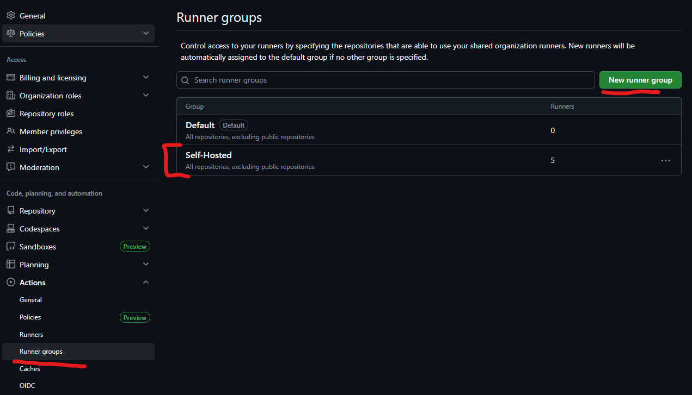
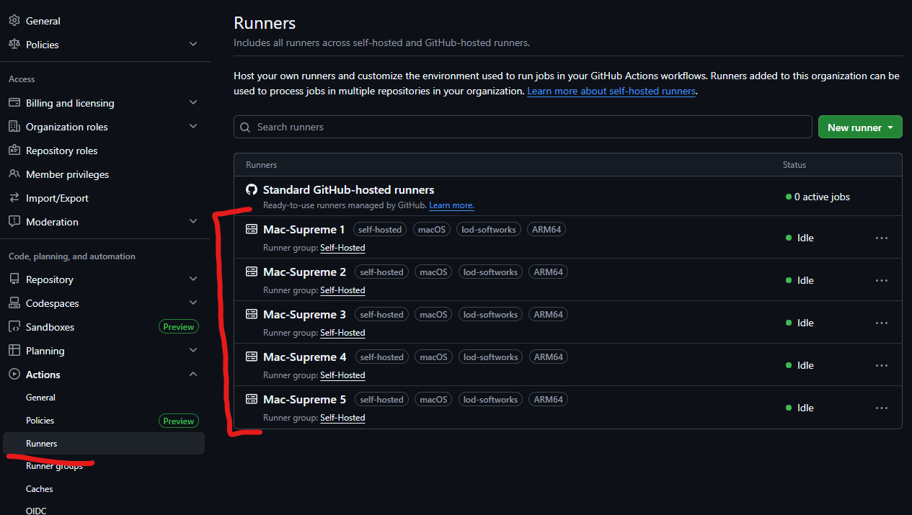

GitHub Actions are awesome. They make it easy to run compilation and tests on pull requests, automate release pipelines, publish packages, and keep project automation close to the code it supports.

For public repositories, that can all be free. For private repositories and heavier usage, the hosted runner minutes can start to add up. Instead of paying for more usage, I wanted to put an existing Mac mini to work and let it handle a meaningful chunk of my CI load. Cost was the starting point, but self-hosted runners also provide larger local caches, access to Apple tooling, a persistent environment, private network reachability, and more control over how CI capacity is carved up.

This machine uses a small macOS runner fleet: multiple GitHub Actions runner installations live under a dedicated runner account, and macOS `launchd` keeps each runner online through configured LaunchDaemons.

<!-- truncate -->

The important idea is not the exact account, repository, or organization names. Those are intentionally abstracted here. The useful pattern is the shape of the system:

- A dedicated macOS user owns the runner files.
- All runner code lives under one top-level GitHub runner directory.
- Runner groups are separated by folder.
- Each runner instance is numbered.
- Each instance has its own runner installation, workspace, and logs.
- LaunchDaemons start the runners on boot and keep them alive.

## Service User Setup

Start by creating a dedicated macOS user for the runners. I prefer a separate account because runner jobs should not execute as my daily login user, and they definitely should not need to run as root for normal build work.

The exact user name is not important. In this article I will use `<runner-user>` as the placeholder.

Create the user:

```bash
sudo sysadminctl \
  -addUser <runner-user> \
  -fullName "GitHub Actions Runner" \
  -home /Users/<runner-user> \
  -shell /bin/zsh \
  -password '<temporary-password>'
```

Create the runner root and make sure the service user owns it:

```bash
sudo mkdir -p /Users/<runner-user>/GitHub
sudo chown -R <runner-user>:staff /Users/<runner-user>/GitHub
sudo chmod 755 /Users/<runner-user>
sudo chmod 755 /Users/<runner-user>/GitHub
```

If the workflows need Homebrew, Xcode command line tools, SDKs, signing assets, package caches, or language runtimes, install and verify those intentionally for the runner user. LaunchDaemons get a much smaller environment than an interactive terminal, so I like to verify the basics from the service account before registering runners:

```bash
sudo -iu <runner-user>
whoami
xcode-select -p
git --version
/opt/homebrew/bin/brew --version
exit
```

For GUI-driven Apple tooling, codesigning, simulator access, or keychain-backed secrets, there may be additional machine-specific setup. Keep that separate from the runner install itself so the runner fleet remains easy to rebuild.

## Directory Layout

The runner home is organized like this:

```text
/Users/<runner-user>/GitHub/
├── <runner-group-a>/
│   ├── 1/
│   │   ├── runner/
│   │   ├── workspace/
│   │   └── log/
│   ├── 2/
│   │   ├── runner/
│   │   ├── workspace/
│   │   └── log/
│   └── ...
├── <runner-group-b>/
│   ├── 1/
│   │   ├── runner/
│   │   ├── workspace/
│   │   └── log/
│   └── ...
└── .nuget/
    └── packages/
```

Each numbered directory is its own GitHub Actions runner instance. That matters because a runner process can only execute one job at a time. If you want five jobs to run in parallel for a given pool, you need five registered runner instances, not one runner with five workspaces.

Inside each instance:

- `runner/` contains the GitHub Actions runner distribution and registration files.
- `workspace/` is where jobs check out repositories and run build steps.
- `log/` receives stdout and stderr from the LaunchDaemon.

This layout makes runner maintenance easy to reason about. If one worker misbehaves, its files, workspace, diagnostics, and logs are all under the same numbered folder.

## Why Multiple Runner Groups?

The machine is split into several abstract runner groups instead of one large undifferentiated pool.

That gives each automation domain its own capacity. A busy set of workflows in one group does not consume every runner on the machine, and labels can route jobs to the correct pool intentionally.

For example, a workflow might target a group-specific label:

```yaml
jobs:
  build:
    runs-on: [self-hosted, macOS, <runner-group-a>]
    steps:
      - uses: actions/checkout@v4
      - run: ./build.sh
```

The specific labels are up to your registration strategy, but the goal is simple: make the queueing model visible in workflow code.

In GitHub organization settings, the runner groups page is where those pools become visible and where repository access can be scoped:



## LaunchDaemons

Each runner is managed by a LaunchDaemon in `/Library/LaunchDaemons`.

The plist files follow this pattern:

```text
/Library/LaunchDaemons/actions.runner.<runner-group>.<runner-number>.plist
```

Each LaunchDaemon points directly at that runner instance's `run.sh`:

```xml
<?xml version="1.0" encoding="UTF-8"?>
<!DOCTYPE plist PUBLIC "-//Apple//DTD PLIST 1.0//EN" "http://www.apple.com/DTDs/PropertyList-1.0.dtd">
<plist version="1.0">
<dict>
  <key>Label</key>
  <string>actions.runner.<runner-group>.<runner-number></string>

  <key>ProgramArguments</key>
  <array>
    <string>/Users/<runner-user/GitHub/<runner-group>/<runner-number>/runner/run.sh</string>
  </array>

  <key>WorkingDirectory</key>
  <string>/Users/<runner-user>/GitHub/<runner-group>/<runner-number>/runner</string>

  <key>RunAtLoad</key>
  <true/>
  <key>KeepAlive</key>
  <true/>

  <key>UserName</key>
  <string><runner-user></string>

  <key>EnvironmentVariables</key>
  <dict>
    <key>PATH</key>
    <string>/opt/homebrew/bin:/opt/homebrew/sbin:/usr/local/bin:/usr/bin:/bin:/usr/sbin:/sbin</string>
  </dict>

  <key>StandardOutPath</key>
  <string>/Users/<runner-user>/GitHub/<runner-group>/<runner-number>/log/actions.runner.out.log</string>
  <key>StandardErrorPath</key>
  <string>/Users/<runner-user>/GitHub/<runner-group>/<runner-number>/log/actions.runner.err.log</string>
</dict>
</plist>
```

Here are a few of the key properties:

- `RunAtLoad` starts the runner when the daemon is loaded or the machine boots.
- `KeepAlive` restarts the runner process if it exits.
- `UserName` keeps the runner out of the root account while still allowing `launchd` to manage it as a system daemon.
- `WorkingDirectory` ensures the runner starts from its own installation folder.
- `StandardOutPath` and `StandardErrorPath` put daemon logs next to the runner instance instead of scattering them elsewhere.

The explicit `PATH` is also worth calling out. LaunchDaemons do not inherit the same shell environment you get in an interactive terminal. If workflows expect tools installed by Homebrew or other standard locations, the daemon needs a predictable path.

## Installing and Registering Runners

Each runner instance is registered separately with GitHub from inside its own `runner/` directory.

The registration token should come from the GitHub UI for the target scope:

- Repository runner: `Settings` -> `Actions` -> `Runners` -> `New self-hosted runner`
- Organization runner: `Organization settings` -> `Actions` -> `Runners` -> `New runner`

GitHub will show the current download URL, checksum, and registration command for macOS. Use those current values instead of copying an old runner version from a blog post.

For each runner instance, create the instance folders:

```bash
mkdir -p /Users/<runner-user>/GitHub/<runner-group>/<runner-number>/{runner,workspace,log}
chown -R <runner-user>:staff /Users/<runner-user>/GitHub/<runner-group>/<runner-number>
```

Download and extract the GitHub Actions runner package as the runner user:

```bash
sudo -iu <runner-user>
cd /Users/<runner-user>/GitHub/<runner-group>/<runner-number>/runner

curl -o actions-runner-osx-<architecture>-<runner-version>.tar.gz \
  -L https://github.com/actions/runner/releases/download/v<runner-version>/actions-runner-osx-<architecture>-<runner-version>.tar.gz

# Optional but recommended: verify the checksum shown by GitHub.
shasum -a 256 actions-runner-osx-<architecture>-<runner-version>.tar.gz

tar xzf actions-runner-osx-<architecture>-<runner-version>.tar.gz
```

Use `x64` or `arm64` for `<architecture>` depending on the Mac. On Apple Silicon, this will usually be `arm64`.

Then register the runner:

```bash
./config.sh \
  --url https://github.com/<account-or-organization> \
  --token <registration-token> \
  --name <runner-group>-<runner-number> \
  --work /Users/<runner-user>/GitHub/<runner-group>/<runner-number>/workspace \
  --labels self-hosted,macOS,<runner-group> \
  --unattended

exit
```

The real registration URL, token, group names, and labels should be specific to your GitHub account or organization. The part I care about preserving is that the runner's work directory is outside the runner binary directory and inside the same numbered instance folder.

At this point, the runner can be tested interactively:

```bash
sudo -iu <runner-user>
cd /Users/<runner-user>/GitHub/<runner-group>/<runner-number>/runner
./run.sh
```

Once GitHub shows the runner connected, stop the interactive process with `Ctrl+C` and let `launchd` own the long-running process instead.

Create a LaunchDaemon plist for the instance using the template from the LaunchDaemons section. Save it somewhere convenient first, then install it into `/Library/LaunchDaemons`:

```bash
sudo cp ./actions.runner.<runner-group>.<runner-number>.plist /Library/LaunchDaemons/
sudo chown root:wheel /Library/LaunchDaemons/actions.runner.<runner-group>.<runner-number>.plist
sudo chmod 644 /Library/LaunchDaemons/actions.runner.<runner-group>.<runner-number>.plist
```

Then load it:

```bash
sudo launchctl bootstrap system /Library/LaunchDaemons/actions.runner.<runner-group>.<runner-number>.plist
sudo launchctl print system/actions.runner.<runner-group>.<runner-number>
```

Repeat that flow for each numbered runner instance. The runner package can be downloaded once and copied into each instance, but each instance still needs its own registration because GitHub treats each worker as a distinct runner.

After the runners are registered and online, GitHub shows each numbered worker under the organization runners page:



## Operating the Fleet

Because each runner is a LaunchDaemon, normal `launchctl` commands are enough to operate the fleet.

Load one runner:

```bash
sudo launchctl bootstrap system /Library/LaunchDaemons/actions.runner.<runner-group>.<runner-number>.plist
```

Stop one runner:

```bash
sudo launchctl bootout system /Library/LaunchDaemons/actions.runner.<runner-group>.<runner-number>.plist
```

Kickstart one runner after changing configuration:

```bash
sudo launchctl kickstart -k system/actions.runner.<runner-group>.<runner-number>
```

Check the daemon:

```bash
sudo launchctl print system/actions.runner.<runner-group>.<runner-number>
```

Tail the logs:

```bash
tail -f /Users/<runner-user>/GitHub/<runner-group>/<runner-number>/log/actions.runner.out.log
tail -f /Users/<runner-user>/GitHub/<runner-group>/<runner-number>/log/actions.runner.err.log
```

This keeps the day-to-day operations small. Most issues are either visible in GitHub's runner UI, the per-runner daemon logs, or the runner's own diagnostic folder under `runner/_diag`.

## Updating Runner Versions

GitHub's runner supports self-update behavior, so the install directory may accumulate versioned `bin` and `externals` folders over time. In practice, this is convenient: each runner updates independently, and the active paths can point at the currently selected runner version.

That said, self-hosted runners are still long-lived machines. They should be treated like infrastructure:

- Keep macOS patched.
- Keep Xcode, Homebrew packages, SDKs, and language runtimes intentional.
- Periodically inspect runner disk usage.
- Clear stale workspaces when jobs leave behind large artifacts.
- Avoid installing one-off dependencies during jobs when they should be part of the machine image.

The more persistent the runner, the more important it is to keep the environment boring and reproducible.

## Security Notes

Self-hosted runners are powerful because workflows execute on your machine. That is also the risk.

For this setup, the main guardrails are:

- Use a dedicated OS account for runner execution.
- Scope runner registration to the smallest useful GitHub boundary.
- Route jobs with labels so untrusted workflows do not land on privileged runners.
- Be very careful with public repositories and pull request workflows.
- Store secrets in GitHub Actions secrets or an external secret manager, not in runner folders.
- Keep runner logs accessible for debugging but avoid writing secrets to stdout or stderr.
- Do not run arbitrary unreviewed workflow changes on a trusted machine.

If you need stronger isolation between jobs, a persistent macOS runner account is not enough by itself. Use ephemeral runners, virtualization, separate machines, or another isolation boundary appropriate to the sensitivity of the workload.

Eventually, I would like to containerize more of this so each job has a cleaner boundary and the host stays less polluted over time. For now, this setup is intentionally quick and dirty: a dedicated service user, a predictable directory layout, and `launchd` keeping the workers alive.

## Gotchas

Self-hosted runners are useful, but they are not hands-off. The machine becomes part of the CI system, and it needs the same care as any other long-running build host.

First, logs will pollute disk space if you let them. Each runner has daemon logs under its `log/` directory, and the runner itself writes diagnostics under `runner/_diag`. Those files are helpful when a runner is unhealthy, but they add up quickly across multiple workers.

For example, inspect runner disk usage regularly:

```bash
du -sh /Users/<runner-user>/GitHub/*/*/log
du -sh /Users/<runner-user>/GitHub/*/*/runner/_diag
```

Then clean up old logs on a schedule:

```bash
find /Users/<runner-user>/GitHub -path '*/log/*.log' -mtime +14 -delete
find /Users/<runner-user>/GitHub -path '*/runner/_diag/*' -mtime +14 -delete
```

Workspaces also grow. Build outputs, dependency folders, temporary files, and failed-job leftovers can turn a small runner fleet into a slow disk-pressure problem. I like checking workspace size separately from runner logs so it is obvious whether the problem is diagnostics or job output:

```bash
du -sh /Users/<runner-user>/GitHub/*/*/workspace
```

You can delete stale workspace contents, but do it intentionally. A busy runner may have an active job in its workspace, so schedule cleanup during a maintenance window or only remove old, known-safe subdirectories.

The biggest gotcha is trust. A self-hosted runner executes arbitrary workflow code on the host. If a workflow can be changed by someone you do not trust, that person may be able to run shell commands on the machine. Labels, branch protection, repository permissions, and pull request rules matter here. Treat runner access like machine access, because in practice that is what it is.

Finally, the host needs the SDKs and CLI tools your workflows expect. GitHub-hosted runners come with a large preinstalled tool cache. Your Mac does not, unless you build one. Install Xcode, Homebrew packages, language SDKs, signing tools, CLIs, and any other dependencies deliberately, then document them so the runner can be rebuilt later.

## Final Shape

The final setup is simple and useful:

```text
GitHub Actions job
  -> targets labels for a specific runner group
  -> lands on one numbered self-hosted runner
  -> runs in that runner's workspace
  -> writes daemon output to that runner's log folder
  -> is supervised by a LaunchDaemon
```

That is the whole pattern. One machine, one dedicated runner account, several small runner pools, and one LaunchDaemon per worker.

It is not fancy infrastructure, which is part of why I like it. The machine has enough structure to make concurrency, logs, and maintenance predictable without turning a handful of self-hosted runners into a platform project.
